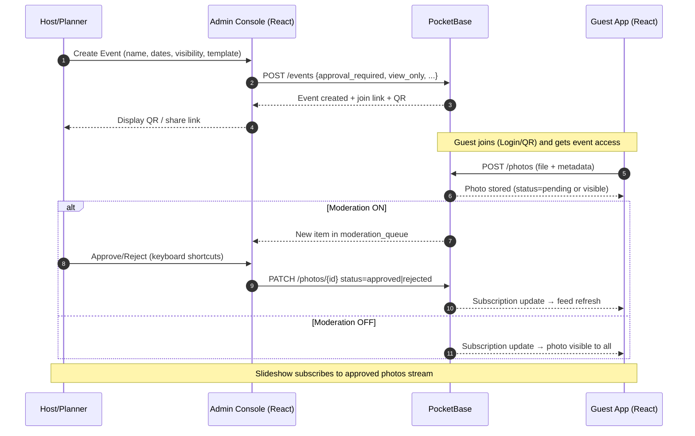
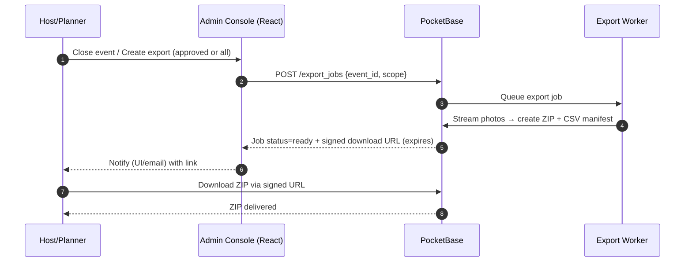

# EventPix – Product Requirements Document (PRD)

**Version:** v0.2 (Merged)  
**Prepared by:** EventPix Project Team

---

## Executive Summary
EventPix is an open‑source, privacy‑first photo‑sharing platform. It enables event hosts and planners to collect photos from attendees in real time via **QR‑code joining** and **simple social sign‑in (Google/Apple)**, with an approval workflow, branding options, and post‑event exports. The core is built on **PocketBase** for simple self‑hosting and realtime subscriptions; the frontends (guest app and admin/planner console) are built with **React + TypeScript**. A hosted SaaS adds higher storage limits, AI‑assisted moderation, analytics, and org/team features.

---

## Table of Contents
1. [Goals & Non‑Goals](#1-goals--non-goals)  
2. [Personas](#2-personas)  
3. [User Stories (selected)](#3-user-stories-selected)  
4. [Functional Requirements – Guest App (React)](#4-functional-requirements--guest-app-react)  
5. [Functional Requirements – Host/Admin (Planner Console)](#5-functional-requirements--hostadmin-planner-console)  
6. [Information Architecture & Data Model (PocketBase)](#6-information-architecture--data-model-pocketbase)  
7. [API Contract (App ↔ PocketBase)](#7-api-contract-app--pocketbase)  
8. [Non‑Functional Requirements](#8-non-functional-requirements)  
9. [UI/UX Requirements – React Components](#9-uiux-requirements--react-components)  
10. [Analytics & Telemetry](#10-analytics--telemetry)  
11. [Rollout & Packaging](#11-rollout--packaging)  
12. [Acceptance Criteria (v1)](#12-acceptance-criteria-v1)  
13. [Risks & Mitigations](#13-risks--mitigations)  
14. [Open Questions](#14-open-questions)  
15. [Sequence Diagrams](#15-sequence-diagrams)

---

## 1. Goals & Non‑Goals

### 1.1 Goals
- Frictionless guest uploads with **QR join** and **one‑tap social login (Google/Apple)**.
- Realtime event feed and slideshow suitable for venue displays.
- Safe‑by‑default **moderation (optional per event)** with optional **AI assistance/quarantine**.
- **Open‑source core** with easy self‑hosting; **hosted SaaS** for power users.
- Planner features: **branding**, **session/area organization**, **exports**, **analytics**.

### 1.2 Non‑Goals (v1)
- Video upload/streaming.
- Face recognition or identity matching.
- Complex registration workflows beyond QR/PIN and social sign‑in.

---

## 2. Personas

### Host / Planner
- Creates events, sets visibility, moderates content, manages branding.
- Needs control, simplicity, and reliability during live events.

### Guest / Attendee
- Scans QR or taps Google/Apple to join quickly; uploads photos without friction.
- Wants simple UI and clear privacy cues; can download/delete own photos.

### Staff Photographer / Volunteer
- Bulk uploads higher‑quality images, tags sessions/locations.
- Needs faster tools and higher limits; can be designated as **Professional Photographer**.

### Org Admin (SaaS)
- Oversees multiple events, billing, storage limits, team roles.

---

## 3. User Stories (selected)
- As a guest, I can scan a QR or use Google/Apple login to join and upload quickly.
- As a host, I can require a PIN or pre‑approval so that uploads remain safe for public displays.
- As a host, I can disable moderation for private family events to avoid delays.
- As a host, I can approve or reject photos in bulk with keyboard shortcuts.
- As a host, I can toggle an “approved‑only” slideshow link to display at the venue.
- As a planner, I can route uploads to session folders via QR parameters (e.g., Keynote, Expo Hall).
- As a host, I can export approved photos as a zip and a public recap page to share post‑event.
- As a guest, I can download and delete my own photos.
- As a host, I can mark a user as **Professional Photographer** with higher limits and credit lines.
- As an org admin, I can view storage usage per event and receive alerts as limits are approached.

---

## 4. Functional Requirements – Guest App (React)

### 4.1 Join & Access
- **Primary:** one‑tap social sign‑in (Google on Android/web; Sign in with Apple on iOS/macOS/web).
- **Alternative:** QR join with optional PIN; supports anonymous sessions if host allows.
- Show concise disclosure of requested profile fields (**display name, avatar, email**).

### 4.2 Upload
- Accept **JPG/PNG/HEIC/HEIF**; server converts to **WebP/JPEG** as needed.
- Batch selection with progress and retry; **offline queue** via PWA background sync.
- Optional caption and prefilled session tag from URL param.

### 4.3 Realtime Feed
- Own uploads appear immediately as **Pending** (or **Visible** if moderation disabled).
- Feed updates via **PocketBase subscriptions**; only approved items visible to others when moderation is on.

### 4.4 Privacy & Consent
- Display “house rules” before first upload.
- **Strip GPS EXIF** by default unless host opts in (event setting).
- Guests can **download and delete** their own photos while event is active and for **30 days** after (configurable).

---

## 5. Functional Requirements – Host/Admin (Planner Console)

### 5.1 Event Setup
- Create event: name, dates, visibility (**public/unlisted/private**), join mode (**open/pin/invite‑only**).
- Branding: **logo**, **theme color**, **overlays/frames**.
- Safety defaults: presets – **Family/Birthday (moderation off)**, **Public/Conference (moderation on)**.

### 5.2 Invites & QR
- Generate **QR codes** and short links with optional PIN; session deep‑links via URL param.
- Join page shows native **Google/Apple** sign‑in buttons.

### 5.3 Moderation Workflow
- Per‑event **`approval_required`** toggle. **OFF** → uploads are immediately visible; **ON** → pending until approved.
- **AI‑assisted flags** (nudity/violence/graphic text) can **quarantine** items for review even when approvals are off.
- Keyboard shortcuts (**A=approve**, **R=reject**), batch actions, reason codes, audit log.

### 5.4 Slideshow
- Public slideshow URL with PIN; **approved‑only** filter; interval and transition settings.
- Optional captions; pause/skip; full‑screen safe margins.

### 5.5 Organization & Search
- Session/area folders; filter by uploader, time range, status, tags.
- Duplicate detection (**perceptual hash**) with merge/hide.

### 5.6 Exports & Sharing
- **Zip export** of approved photos (or all) with **CSV manifest**; async job with time‑limited link & email notification.
- Recap page with selected highlights; cloud archive push to **OneDrive/Google Drive/Dropbox**.

### 5.7 Roles & Modes
- **View‑only mode:** guests can view/download (if allowed) but **cannot upload**.
- **Professional Photographer** role: can upload even in view‑only mode; higher caps; credit on recap/export.

### 5.8 Billing & Quotas (SaaS)
- Plan limits by events, storage (MB), and photo count; soft/hard behaviors.
- Usage dashboard with alerts; upgrade flow; org/team roles.

---

## 6. Information Architecture & Data Model (PocketBase)
- Collections: `users` (auth), `orgs`, `events`, `memberships`, `invitations`, `photos`, `moderation_queue`, `reactions`, `comments`, `albums`, `overlays`, `subscriptions`, `export_jobs`.
- `users`: `provider` (enum), `provider_id` (string), `display_name` (text), `avatar` (file/url).
- `events`: `visibility`, `join_mode`, `approval_required` (bool), `allow_anonymous_uploads` (bool), `strip_exif` (bool), `allow_downloads` (bool), `storage_limit_mb`/`storage_used_mb`, `view_only` (bool), `default_template` (enum), `moderation_profile` (json).
- `memberships`: `role` includes `host`, `staff`, `guest`, `photographer`; `status`.
- `photos`: `event`, `owner_user`, `file`, `status` (`pending|approved|rejected|quarantined`), `caption`, `session_tag`, `exif` (json), `phash`, `ai_scores` (json), `blurred` (bool).
- `export_jobs`: `event`, `status`, `file`, `manifest_json`, `created_by`, `expires_at`.

---

## 7. API Contract (App ↔ PocketBase)
- **Auth:** social OAuth/OIDC (**Google/Apple**). Minimal scopes to obtain **name, avatar, email**. Anonymous session allowed if event permits.
- **Subscriptions:** realtime on `photos` (event‑scoped) and `moderation_queue`; slideshow subscribes to approved stream.
- **Uploads:** multipart to `photos.file`; server computes thumbnails, `phash`, parses/strips EXIF.
- **Moderation endpoints:** approve/reject/quarantine; reason codes; emit webhooks (cloud).
- **Exports:** `POST export_jobs` → background zip; `GET` when ready returns signed URL; includes **CSV manifest**.

---

## 8. Non‑Functional Requirements

### 8.1 Performance
- P95 photo upload init **< 2s** on 4G; thumbnail visible within **5s** after upload completes.
- Slideshow advance smooth at **60fps** on modern browsers; lazy‑load and prefetch.

### 8.2 Reliability
- Retries for uploads; **offline queue** with background sync.
- Server job queue with **idempotency**; no data loss on restarts; backups for SaaS.

### 8.3 Security & Privacy
- **HTTPS** transport; **short‑lived signed URLs** for original downloads (SaaS).
- Consent & reporting features; **EXIF strip** default; configurable **retention** policy.

### 8.4 Accessibility
- **WCAG 2.1 AA**: color contrast, keyboard nav, focus states, alt text.

### 8.5 Internationalization
- English v1; framework for i18n strings; **RTL** support ready.

---

## 9. UI/UX Requirements – React Components

### 9.1 Guest App Components
- `QRCodeJoin`: reads URL params, handles PIN entry; shows Google/Apple buttons; supports QR path.
- `Uploader`: file picker + camera capture; progress, retry, offline queue.
- `Feed`: masonry/grid with blurhash placeholders; status badges (pending/approved).
- `PhotoCard`: responsive image, caption, actions (download/delete own).
- `Toasts/Alerts`: upload success, moderation notice.

### 9.2 Admin Console Components
- `EventForm`: settings, branding, safety presets.
- `ModerationQueue`: keyboard shortcuts, AI flags, bulk actions.
- `SlideshowControls`: approved‑only toggle, interval/transition, PIN gate.
- `SessionManager`: folder list, QR deep links, counts, filters.
- `UsageMeter`: storage totals, limits, upgrade CTA.
- `Exporter`: create/track export jobs; email notify; download link.

---

## 10. Analytics & Telemetry
- Events created; contributors per event; uploads per contributor.
- Median time‑to‑first‑upload after QR/login.
- Moderation approval rate; review time; AI flag rates.
- Slideshow impressions/time on screen; heartbeat pings.
- Conversion: free→pro; storage utilization over time.

---

## 11. Rollout & Packaging
- Open‑source core repos: **app (React)** + **backend (PocketBase migrations)** + **media worker**.
- Docker Compose for self‑host; Vercel for marketing; CI with preview deployments.
- Feature flags: AI moderation, slideshow v2, sponsor analytics.

---

## 12. Acceptance Criteria (v1)
- Guest can join via **Google or Apple** and upload 5 photos on 4G; feed reflects pending→approved without refresh.
- With moderation **OFF**, a new upload becomes visible to all viewers within ~**5s** of completion.
- Host approves/rejects **50** photos in **< 3 minutes** using keyboard shortcuts.
- Slideshow URL shows only **approved** photos when enabled and can be **PIN‑gated**.
- Zip export contains all approved photos with **CSV manifest** and consistent filenames.
- Guest can **download and delete** their own photos; deletions propagate to feed/slideshow.
- **View‑only** mode blocks uploads from non‑photographer guests while allowing photographer uploads.

---

## 13. Risks & Mitigations
- **Abuse on public events** → default `approval_required` ON for public; PIN‑gate slideshow; rate‑limit uploads.
- **AI false positives** → AI is advisory; human review required; easy overrides with reasons.
- **Storage costs (SaaS)** → aggressive thumbnailing; lifecycle policies; archive/export tools.
- **HEIC compatibility** → server‑side conversion; client‑side fallback; test large images.

---

## 14. Open Questions
- Per‑photo download restrictions in v1?
- Guest display names for recap credits—required or optional?
- Dedicated “family mode” album separate from event feed?

---

## 15. Sequence Diagrams

> Diagrams use Mermaid and render on GitHub.

### 15.1 Login Flow (Google/Apple or QR/PIN)
```mermaid
sequenceDiagram
  autonumber
  participant U as User (Guest)
  participant W as Web App (React)
  participant OP as OAuth Provider (Google/Apple)
  participant PB as PocketBase

  U->>W: Open Join Page (from QR or link)
  W-->>U: Show buttons (Google/Apple) + QR/PIN option
  alt Social Sign-In
    U->>W: Click "Continue with Google/Apple"
    W->>OP: Start OAuth (OIDC) auth code flow
    OP-->>W: Auth code (redirect)
    W->>PB: Exchange code → tokens; fetch profile (name, avatar, email)
    PB-->>W: Upsert user {provider, provider_id, display_name, avatar, email}
    W->>PB: Create/confirm membership for event (role=guest)
    PB-->>W: Session + event access granted
    W-->>U: Joined & ready to upload
  else QR/PIN
    U->>W: Enter PIN (optional) / Proceed
    W->>PB: Request anonymous session (if allowed)
    PB-->>W: Session + event access granted
    W-->>U: Joined & ready to upload
  end
```

### 15.2 Event Creation & Photo Upload


### 15.3 Event Completion & Bulk Download


---

**End of Document**
